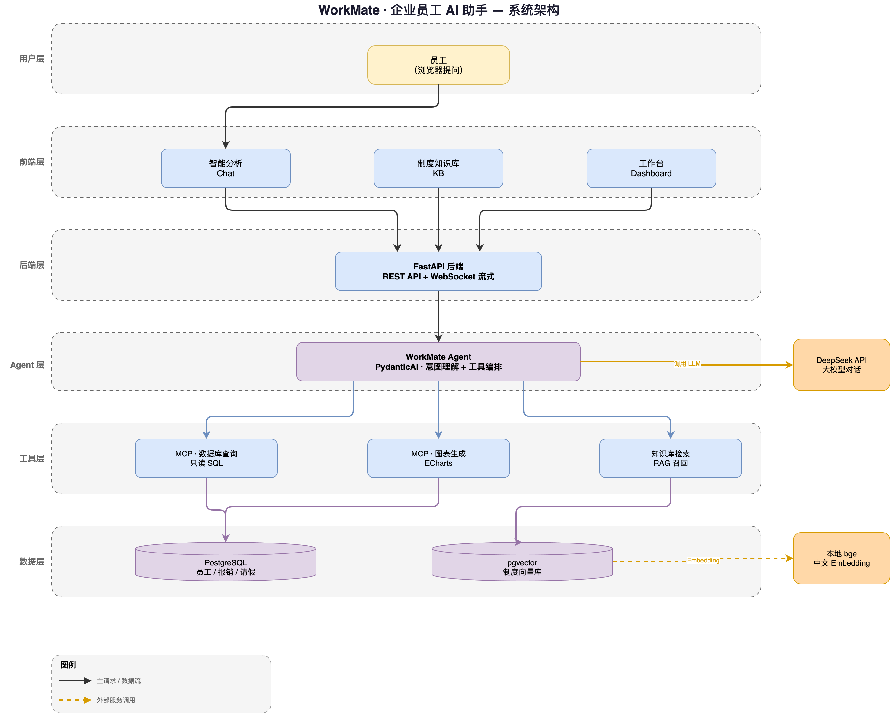
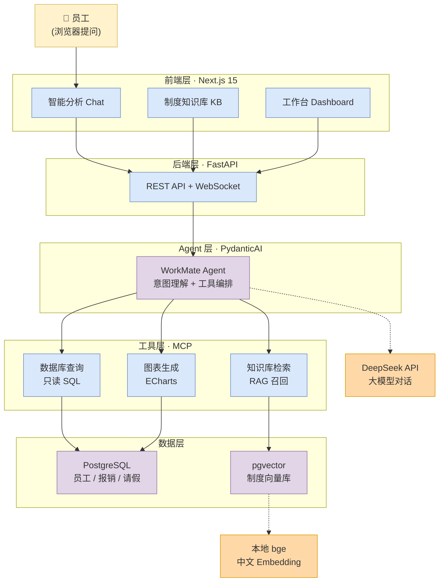

# Full-Stack AI Agent Template

> Generate a production-ready **FastAPI + Next.js** app — with AI agents, RAG, teams, billing, and admin — from a single command.

**English** | [中文](README.md)

This repository is both an **AI app generator** and a **runnable showcase**:

- **Generator** (`fastapi-fullstack`): an interactive CLI that assembles your stack from 199 configuration options and generates production-grade full-stack code.
- **Showcase** (`ai_agent_test/`): a real app generated from this template, customized as **WorkMate · Enterprise Employee AI Assistant** — runs out of the box, great for demos.

---

## ✨ At a glance

**Crisp vector version** (exported from draw.io, click to zoom):

<picture>
  <source srcset="ai_agent_test/docs/workmate-arch.svg" type="image/svg+xml">
  
</picture>

**Interactive Mermaid version** (native GitHub rendering, zoomable):



---

## 🚀 WorkMate · Enterprise Employee AI Assistant

`ai_agent_test/` is a real app generated from this template, customized as an internal employee assistant: employees skip the policy docs and HR queue — ask in plain Chinese about reimbursements, leave, or company policy, and get answers backed by **SQL evidence** and **document citations**.

| Scenario | Capability |
|---|---|
| Expense lookup | Records / totals / aggregation by department·time·status, SQL expandable |
| Leave & annual days | Leave history, remaining days, policy into the prompt |
| Policy Q&A | Employee handbook, expense rules in the vector store; answers cite sources |
| Charts | SQL results rendered as ECharts |
| DeepSeek balance | Live API account balance on the dashboard |

**Stack**: FastAPI · PostgreSQL(pgvector) · local bge Chinese embeddings · PydanticAI · MCP · Next.js 15 · ECharts · DeepSeek

**One-command start (macOS / Linux)**

```bash
cd ai_agent_test
./run.sh --local        # local mode: install deps + start backend/frontend + migrate
./run.sh --local status # status
# or Docker mode: ./run.sh
```

- Frontend http://localhost:3000 · Backend http://localhost:8000 · Docs http://localhost:8000/docs
- Pre-seeded admin: `admin@example.com / admin123`

See [ai_agent_test/README.zh-CN.md](ai_agent_test/README.zh-CN.md) for details.

---

## 🧩 Generator capability matrix

The generator ships **199 configuration options**, covering everything from a bare backend API to a production SaaS.

### Backend

| Area | Options |
|---|---|
| Database | PostgreSQL (async asyncpg) · MongoDB (async motor) · SQLite (sync) · none |
| ORM | SQLAlchemy · SQLModel |
| Layers | FastAPI + Pydantic v2 + Alembic + Service / Repository architecture |
| Auth | JWT + refresh token + API key · local auth · OAuth (Google) · Magic Link |

### AI & RAG

| Area | Options |
|---|---|
| AI frameworks | PydanticAI · LangChain · LangGraph · CrewAI · DeepAgents · none |
| LLM providers | OpenAI · Anthropic · Google Gemini · OpenRouter · all (runtime selection) |
| Vector stores | Milvus · Qdrant · ChromaDB · pgvector |
| Embeddings | OpenAI · Voyage · Gemini · local Sentence-Transformers |
| Rerankers | Cohere · local Cross-Encoder |
| PDF parsers | PyMuPDF (local) · LlamaParse (cloud AI) · LiteParse (local AI) · all |
| RAG extras | Hybrid search · OCR · image description · Google Drive / S3 sync sources |

### Frontend (Next.js 15)

- App Router + Tailwind · i18n (next-intl) · dark/light theme
- Pages: auth · chat · knowledge base · dashboard · admin · billing · marketing site

### SaaS & operations

| Area | Options |
|---|---|
| Tenancy | Single · multi-org (teams/invites) · platform |
| Billing | Stripe: subscription / usage / hybrid / one-time + credits system |
| Email | Resend · SMTP · console log (dev) |
| Task queues | Celery · Taskiq · ARQ |
| Deploy | Docker Compose · optional Kubernetes · Nginx / Traefik |
| CI/CD | GitHub Actions · GitLab CI |
| Extras | Admin panel · usage dashboard · requirement-KB MVP (Chinese workbench) · channel bots |

---

## 🛠 Quick start

### Install repo dependencies

```bash
uv sync
```

### Interactive wizard

```bash
uv run fastapi-fullstack
```

### Direct CLI

```bash
uv run fastapi-fullstack new --minimal                    # minimal backend-only
uv run fastapi-fullstack create my_app --database sqlite  # SQLite
uv run fastapi-fullstack create my_app --database postgresql --rag
uv run fastapi-fullstack create my_app --frontend nextjs --preset production-saas
uv run fastapi-fullstack templates                        # list options/presets
```

Then follow the generated project's README and Makefile:

```bash
cd my_app
make bootstrap    # Docker full stack: build + up + migrate + seed
```

---

## 📁 Repository layout

| Path | Purpose |
|---|---|
| `fastapi_gen/` | Generator: CLI, Pydantic config models, interactive prompts, Cookiecutter invocation |
| `template/` | App template: backend, frontend, docs, Docker, post-gen hooks |
| `tests/` | Generator & template contract tests |
| `ai_agent_test/` | WorkMate enterprise employee assistant (generated real app, see above) |
| `docs/` | Architecture docs, requirement-KB PRD, specs, demo notes |
| `scripts/` | Repo-level verification & preview scripts |

---

## 🔧 Development

### Verification

```bash
uv run pytest            # all tests
uv run ruff check . --fix
uv run ruff format .
uv run ty check fastapi_gen
```

### Adding features

**New generator option**: add enum in `config.py` → prompt in `prompts.py` → default in `cookiecutter.json` → conditional in `template/` → cleanup in `post_gen_project.py` → docs in `VARIABLES.md`.

**New vector store**: add `VectorStoreType` value → adapter in `vectorstore.py` → wire deps & RAG commands.

**New requirement-KB workflow**: keep source of truth in backend services → extend `schemas/rag.py` → routes in `knowledge_bases.py` → update tests & frontend.

---

## 📜 License

See [LICENSE](LICENSE).
